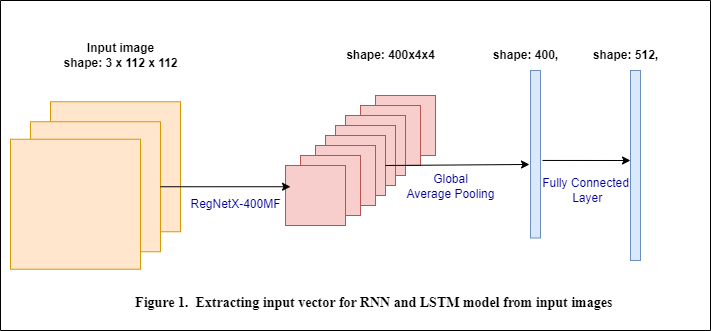
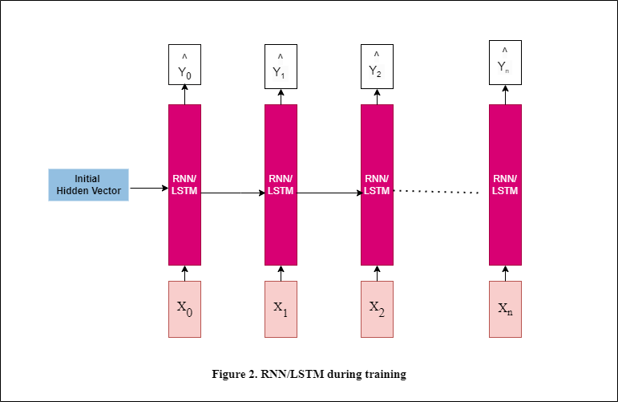
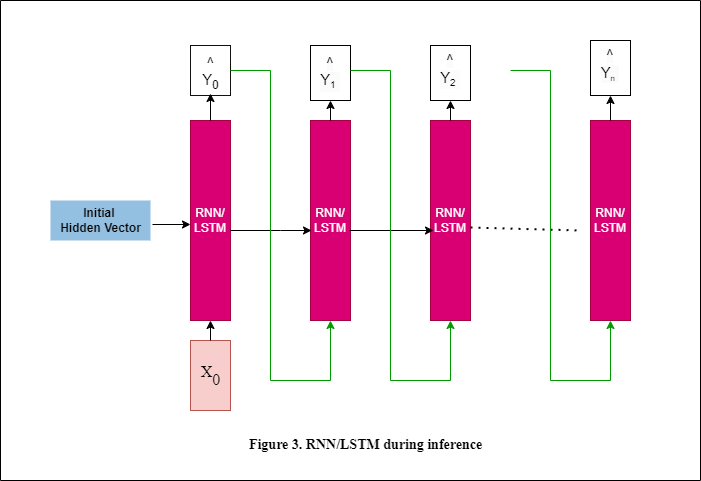
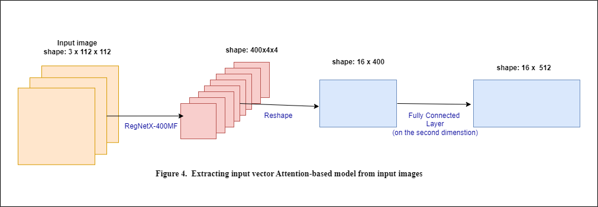

# Image_Caption

This project focus on generating captions for images using 3 model architectures: vanilla recurrent neural networks (RNNs), [long-short term memory networks (LSTMs)](https://www.researchgate.net/publication/13853244_Long_Short-term_Memory), and [attention-based LSTMs](https://arxiv.org/abs/1409.0473).

Models in this exercise are highly similar to very early works in neural-network based image captioning. If you are interested to learn more, check out these two papers:

1. [Show and Tell: A Neural Image Caption Generator](https://arxiv.org/abs/1411.4555)
2. [Show, Attend and Tell: Neural Image Caption Generation with Visual Attention](https://arxiv.org/abs/1502.03044)
## 1. Image Feature Extractor

The first essential component in an image captioning model is an encoder that inputs an image and produces features for decoding the caption.
Here, we use a small [RegNetX-400MF](https://pytorch.org/vision/stable/models.html#torchvision.models.regnet_x_400mf) as the backbone so we can train in reasonable time on Google Colab.

It accepts image batches of shape `(B, C, H, W)` and outputs spatial features from final layer that have shape `(B, 400, H/32, W/32)`. For this specific project, since training images are scaled down to `3x124x124`, output of the Image Feature Extractor is of shape `B,400,4,4`.
For vanilla RNN and LSTM, we use the average pooled features (shape `(B, 400)`) for decoding captions, whereas for attention LSTM we aggregate the spatial features by learning attention weights.
Checkout the `ImageEncoder` method in `rnn_lstm_captioning.py` to see the initialization of the model.
## 2. Architecture for RNN-Captioning and LSTM-Captioning Models
<p>
  

</p>

Results from the process described above will be treated as initial hidden vector for RNN (and LSTM) model.
Inputs for these models include 2 components: hidden vector and word embedding vector. 
<p>
  

</p>

<p>
  

</p>

## 2. Architecture for Attention-based Captioning Model
<p>
  

</p>
As for Attention-based Captioning Model, we will also use RNN/LSTM mechanism. What is different is inputs  for an RNN/LSTM step, now including: hidden vector, attention vector and word embedding vector.
What's noticeable here is how we compute attention vector. 

```
Query vector: hidden vector
Key - Value Matrix: output from the process in Figure 4, which, in this project, is 16 vectors of size 512. 

Compute Similarity Matrix: dot product between Query vector and each vector in Key Matrix
Compute attention vector: weighted sum of Value Matrix with entries of Similarity Matrix
```
